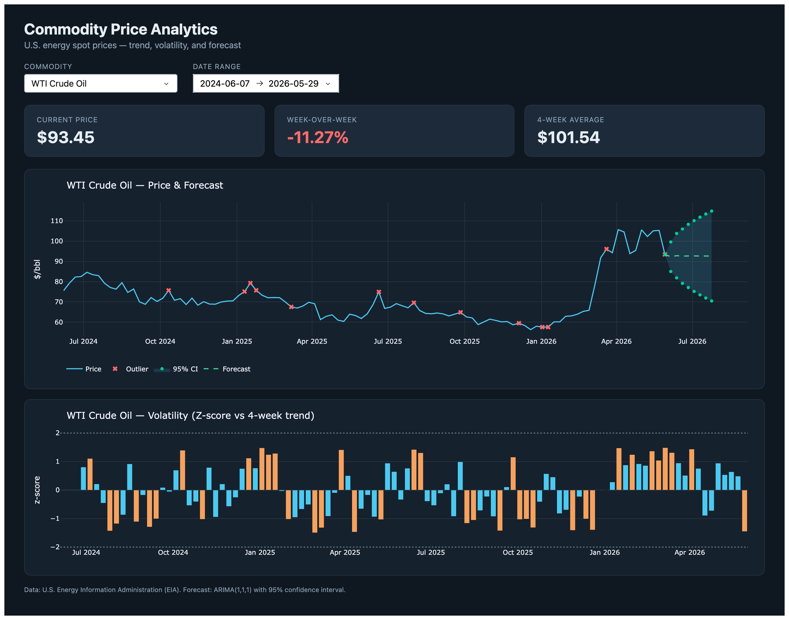

# Commodity Price Analytics Dashboard

A production-structured Python application that ingests live U.S. energy
commodity prices from the [EIA public API](https://www.eia.gov/opendata/),
transforms and stores them in a relational database, and serves an interactive
[Plotly Dash](https://dash.plotly.com/) dashboard with trend analysis and
time-series forecasting.

**Commodities tracked:** WTI Crude Oil, Natural Gas (Henry Hub), Regular Gasoline.

> Built to demonstrate Python data engineering, OOP design, SQL, REST API
> integration, data visualization, and testing.

📓 See [`concept_walkthrough.md`](concept_walkthrough.md) for a stage-by-stage
log of the concepts, design decisions, and trade-offs behind the build — or open
[`concept_walkthrough.html`](concept_walkthrough.html) in a browser for a
navigable version with collapsible interview Q&A and search.
🧪 See [`MANUAL_TESTING.md`](MANUAL_TESTING.md) for hands-on commands to exercise
each layer by hand.

---

## Dashboard



A commodity selector and date-range filter drive three KPI cards (current price,
week-over-week change, 4-week average), a price chart with an ARIMA forecast and
95% confidence band (outliers marked), and a color-coded z-score volatility chart.

---

## Architecture

```
EIA REST API
     │  (requests, retries, logging)
     ▼
[ ingestion ]  EIAClient ─────► raw JSON
     │
     ▼
[ transform ]  CommodityPipeline ─► clean + enriched DataFrame
     │            (pct_change, rolling avg/std, z-score)
     ▼
[ storage ]    CommodityRepository ─► SQLite (repository pattern)
     │            raw_prices | processed_prices
     ▼
[ analytics ]  PriceForecaster (ARIMA) ─► forecast + CI
     │
     ▼
[ dashboard ]  Plotly Dash ─► interactive charts + KPIs
```

---

## Tech Stack

| Layer        | Tools                              |
|--------------|------------------------------------|
| Ingestion    | `requests`                         |
| Transform    | `pandas`, `numpy`                  |
| Storage      | `sqlite3` (stdlib)                 |
| Forecasting  | `statsmodels`, `scikit-learn`      |
| Dashboard    | `plotly`, `dash`                   |
| Testing      | `pytest`                           |
| Config       | `python-dotenv`                    |

---

## Setup

Requires **Python 3.11+** (developed on 3.14).

```bash
# 1. Clone and enter the project
git clone <your-repo-url> commodity-dashboard
cd commodity-dashboard

# 2. Create and activate a virtual environment
python3 -m venv .venv
source .venv/bin/activate        # Windows: .venv\Scripts\activate

# 3. Install dependencies
pip install -r requirements.txt          # runtime only
# pip install -r requirements-dev.txt    # + pytest, black, flake8

# 4. Configure your environment
cp .env.example .env
# Edit .env and add your free EIA API key from https://www.eia.gov/opendata/
```

---

## Usage

Populate the database end-to-end with the orchestration script:

```bash
python run_pipeline.py                      # all commodities, incremental
python run_pipeline.py --refresh            # force a full re-fetch
python run_pipeline.py --series WTI_CRUDE   # a single commodity
python run_pipeline.py --start 2024-01-01 --end 2024-12-31
python run_pipeline.py --help               # full CLI reference
```

It fetches from the EIA API, transforms and enriches the data, and upserts both
the raw and processed tables, printing a summary of what changed.

```bash
# Launch the interactive dashboard at http://127.0.0.1:8050
python -m dashboard.app
```

---

## Configuration

All settings live in `.env` (never committed). See `.env.example` for the
template.

| Variable            | Default              | Description                              |
|---------------------|----------------------|------------------------------------------|
| `EIA_API_KEY`       | _(required)_         | Free key from eia.gov/opendata           |
| `DB_PATH`           | `data/commodity.db`  | SQLite database location                 |
| `DEFAULT_COMMODITY` | `WTI_CRUDE`          | Commodity shown on first load            |
| `LOOKBACK_DAYS`     | `730`                | Days of history to fetch by default      |

---

## Project Structure

```
commodity-dashboard/
├── config.py               # dotenv-backed settings + EIA commodity catalog
├── run_pipeline.py         # orchestration CLI (fetch → transform → store)
├── ingestion/
│   └── eia_client.py       # EIAClient: EIA v2 API client (retries, backoff)
├── transform/
│   └── pipeline.py         # CommodityPipeline: parse → clean → enrich
├── storage/
│   └── repository.py       # CommodityRepository: SQLite, repository pattern
├── analytics/
│   └── forecasting.py      # PriceForecaster (ARIMA) + LinearTrendForecaster
├── dashboard/
│   ├── layout.py           # Dash layout (controls, KPI cards, charts)
│   ├── callbacks.py        # pure figure/KPI builders + render() + callbacks
│   └── app.py              # Dash app entry point (WSGI-ready)
├── tests/                  # pytest suite (32 tests, in-memory DB fixtures)
├── scripts/
│   └── capture_screenshot.py
└── data/commodity.db       # SQLite database (git-ignored)
```

---

## Design Decisions

**Why the repository pattern?** All SQL lives in `CommodityRepository`; every
other layer trades in DataFrames. The storage engine could move from SQLite to
Postgres by rewriting one file — the pipeline, forecaster, and dashboard would
not change. It also makes the rest of the codebase testable without a database.

**Why SQLite over Postgres?** The project is a single-node analytics app with
modest, append-mostly data. SQLite is zero-config, file-based, and bundled with
Python — perfect for a portfolio app that should "clone and run." The repository
abstraction keeps the door open to Postgres/RDS if scale ever demanded it.

**Why separate `raw_prices` from `processed_prices`?** Raw observations are
immutable facts (`INSERT OR IGNORE`); processed analytics are a derived view that
is recomputed and overwritten (`ON CONFLICT DO UPDATE`). The orchestrator ingests
raw incrementally, then rebuilds processed from the *full* raw history so
rolling-window stats stay correct — a small lambda-architecture split.

**Why ARIMA(1,1,1)?** Commodity prices are non-stationary, so the model needs one
order of differencing (the middle `1`). A small, interpretable model is more
defensible than an overfit one — the goal is to demonstrate time-series literacy,
backed by AIC/BIC, not to win a forecasting contest.

**Why EIA?** Free, no credit card, well-documented, and directly relevant to the
energy sector. The client targets the current **v2** API (route + series facet),
not the deprecated v1 series IDs.

**Why Plotly Dash?** It pairs an interactive React front end with pure-Python
callbacks, so the whole stack stays in one language. Keeping the data→figure
logic in pure functions makes the UI unit-testable without a browser.

---

## Development

```bash
pip install -r requirements-dev.txt   # pytest, black, flake8

pytest                # run the test suite (32 tests)
black .               # auto-format
flake8 .              # lint (config in .flake8)
```

Formatting (`black`) and linting (`flake8`) pass cleanly across the codebase, and
the full test suite runs offline in ~1.3s.

---

## Project Status

Built in independent chunks; each leaves the project runnable.

- [x] **Chunk 1** — Project setup & configuration
- [x] **Chunk 2** — Ingestion layer (EIA API client)
- [x] **Chunk 3** — Transformation pipeline
- [x] **Chunk 4** — Storage layer (repository pattern)
- [x] **Chunk 5** — Orchestration script
- [x] **Chunk 6** — Forecasting module
- [x] **Chunk 7** — Plotly Dash dashboard
- [x] **Chunk 8** — Test suite
- [x] **Chunk 9** — Polish & documentation

Tagged **`v1.0.0`**.

---

## License

This is a personal portfolio project.
